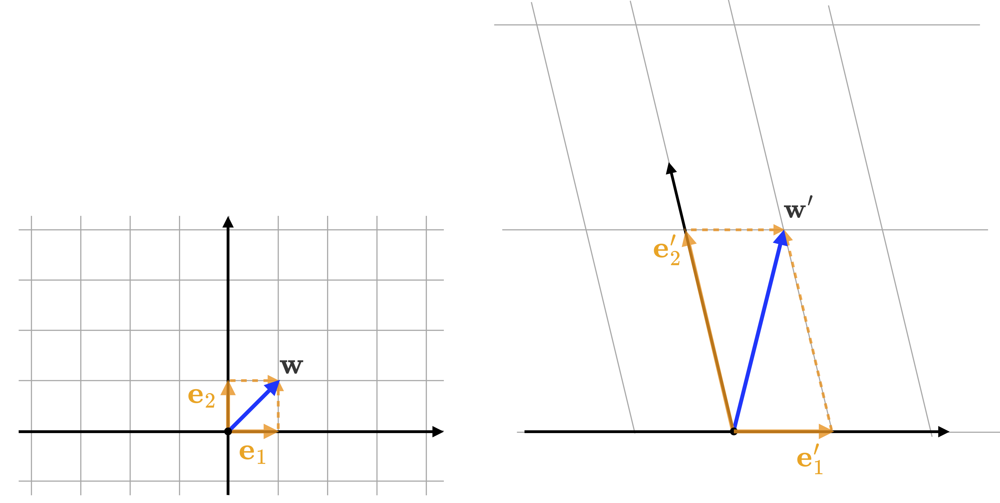

# Changing Coordinate Frames 

These notes describe the concept of change of coordinates or change of frames. For simplicity, the theory and examples are given in two dimensions. However, conversion to higher dimensions is straightforward. 

## A vector in the standard basis

Let us begin by writing a vector ${\bf x} \in \mathbb{R}^2$ with respect to the standard basis $\left\{{\bf i},{\bf j}\right\}$ (Figure 1). 

**Figure 1**: Vector  ${\bf x} \in \mathbb{R}^2$ represented as a linear combination of the basis vectors. The vector's coordinates, $x$ and $y$, are represented with respect to the standard basis $\left\{{\bf i},{\bf j}\right\}$. 

In this basis, we can write the vector as ${\bf x} = x {\bf i} + y {\bf j}$, which is a linear combination of the basis vectors, where $x \in \R$ and $y\in \R$ are scalars.  This is equivalent to writing ${\bf x}$ as a sum of the scaled versions of vectors ${\bf i}$ and ${\bf j}$, where the scalars $x$ and $y$ are the coordinates of ${\bf x}$ in the standard basis. 

## The same vector represented with respect to another basis

Sometimes, it is convenient for us to represent a vector with respect to a different frame of reference. To see how this works, let us represent ${\bf x}$ with respect to another basis, say $\left\{{\bf u},{\bf v}\right\}$. To do that, we write ${\bf x}$ as a linear combination of the new basis, i.e.,  ${\bf x} = u {\bf u} + v {\bf v}$, with $u,v\in\R$.  In this case, scalars  $u$ and $v$ are the coordinates of ${\bf x}$ with respect to the basis $\left\{{\bf u},{\bf v}\right\}$. For simplicity, we assume that the basis is formed by unit vectors (i.e., normalized vectors). Figure 2 shows vector ${\bf x}$  and the two bases, $\left\{{\bf i},{\bf j}\right\}$ and $\left\{{\bf u},{\bf v}\right\}$. 

**Figure 2**: A vector ${\bf x}$ represented with respect to two different coordinate frames (i.e., bases). In the standard basis, ${\bf x = (2,3)^\mathsf{T}}$. In the $\left\{{\bf u},{\bf v}\right\}$ basis,  ${\bf x = (0,3)^\mathsf{T}}$. In the new basis, the value of the first coordinate vanishes. In some applications, it might be easier to work vectors given in the $\left\{{\bf u},{\bf v}\right\}$ basis than vectors given in the  $\left\{{\bf i},{\bf j}\right\}$ basis (e.g., a set of points lying along the ${\bf u}$ direction would have their representation reduced from 2-D to 1-D).

## **Converting from one basis to another**

We now want to find a way to convert a vector's representation from one basis to another. This is the same to changing between coordinate systems or coordinate frames. Let us start by writing ${\bf x} = x {\bf i} + y {\bf j}$ and also ${\bf x} = u {\bf u} + v {\bf v}$, which are *two representation of the same vector*. This equivalence is written as:
$$
\begin{align}
x\, {\bf i} + y\, {\bf j} &= u\, {\bf u} + v\, {\bf v},\\
\end{align}
$$
which can be matrix form as:
$$
\begin{align}
 		\begin{bmatrix}
	{\bf i} & {\bf j}
	\end{bmatrix}
	\begin{bmatrix}    
	x \\    
	y  
	\end{bmatrix}
	&=
 		\begin{bmatrix}
	{\bf u} & {\bf v}
	\end{bmatrix}
	\begin{bmatrix}    
	u \\    
	v  
	\end{bmatrix}. 
	\label{step2}
	\end{align}
$$
Because matrix $\left[{\bf i},\,\, {\bf j}\right]$ is the identity, the expression in ($\ref{step2}$) simplifies to: 
$$
\begin{align}
	\begin{bmatrix}    
	x \\    
	y  
	\end{bmatrix}
	&=
 		\begin{bmatrix}
	{\bf u} & {\bf v}
	\end{bmatrix}
	\begin{bmatrix}    
	u \\    
	v  
	\end{bmatrix},
  \label{eq_uv2xy}
	\end{align}
$$
or in short: 
$$
\begin{align}
	\begin{bmatrix}    
	x \\    
	y  
	\end{bmatrix}
	&=
 	T
	\begin{bmatrix}    
	u \\    
	v  
	\end{bmatrix}, 
	\label{T}
	\end{align}
$$
where $T$ is the transformation matrix that converts from coordinates $\left(u,v\right)$ to coordinates $\left(x,y\right)$. This transformation matrix has its columns as the basis vectors of the new coordinate frame. Conversely, we can convert from $\left(u,v\right)$ coordinates $\left(x,y\right)$ coordinates by using the inverse of $T$, i.e.: 
$$
\begin{align}
	\begin{bmatrix}    
	u \\    
	v  
	\end{bmatrix}
	&=
 	T^{-1}
	\begin{bmatrix}    
	x \\    
	y  
	\end{bmatrix}. 
	\label{eq_xy2uv}
	\end{align}
$$
Note that the basis vectors do not need to be orthonormal (i.e., both orthogonal and unit vectors). If the basis vectors are orthonormal then matrix $T$ in Equation $\ref{T}$ will be an orthogonal matrix. An orthogonal matrix has its inverse equal to its transpose. As a result, Equation $\ref{eq_xy2uv}$ simplifies to: 
$$
\begin{align}
	\begin{bmatrix}    
	u \\    
	v  
	\end{bmatrix}
	&=
 	T^{\mathsf{T}}
	\begin{bmatrix}    
	x \\    
	y  
	\end{bmatrix}, 
	\label{eq_xy2uv_2}
	\end{align}
$$
where the change-of-coordinates matrix from $\left(x,y\right)$ to $\left(u,v\right)$ is formed by stacking the vectors of the new basis as the rows of the matrix.

### **Numerical Example**

Let ${\bf p}_{xy} = \left(4,3\right)^\mathsf{T}$ be a point in $\R^2$ with coordinates given with respect to the standard basis $\left\{{\bf i},{\bf j}\right\}$. Let $\left\{\hat{\bf u},\hat{\bf v}\right\}$ be another basis where:
$$
\begin{align}
\hat{\bf u} = \frac{\left(4,3\right)^\mathsf{T}}{\|\left(4,3\right)\|} = \left(\frac{4}{5},\frac{3}{5}\right)^\mathsf{T}
\end{align}
$$
and
$$
\begin{align}
\hat{\bf v} = \frac{\left(-3,4\right)^\mathsf{T}}{\|\left(-3,4\right)\|}  = \left(-\frac{3}{5},\frac{4}{5}\right)^\mathsf{T}.
\end{align}
$$
Note that we chose the components of vectors ${\bf u}$​ and ${\bf v}$​ in a way that simplifies the visualization. However, we could have chosen any pair of linearly independent vectors in $\R^2$​. Here, we are also normalizing the basis vectors but they do not necessarily need to be normalized.  From Equation $\ref{eq_uv2xy}$, we know that: 

$$
\begin{align}
{\bf p}_{xy} = 
 		\begin{bmatrix}
	\hat{\bf u} & \hat{\bf v}
	\end{bmatrix}
	\,{\bf p}_{uv}, 
	\end{align}
$$
where ${\bf p}_{uv}$ are the coordinates of the point represented with respect to basis  $\left\{\hat{\bf u},\hat{\bf v}\right\}$. Explicitly, we have: 
$$
{\bf p}_{xy} =
\begin{bmatrix}
		\frac{4}{5} & -\frac{3}{5} \\
		\frac{3}{5} & \frac{4}{5}
	\end{bmatrix}
{\bf p}_{uv}.
$$
We can calculate the coordinates ${\bf p}_{uv}$ simply by inverting the transformation matrix in the above equation as we have seen before in Equation $\ref{eq_xy2uv}$, i.e.: 
$$
\begin{align}
{\bf p}_{uv} &=
\begin{bmatrix}
		\frac{4}{5} & -\frac{3}{5} \\
		\frac{3}{5} & \frac{4}{5}
	\end{bmatrix}^{-1}
{\bf p}_{xy} 
\notag \\ &= 
\frac{1}{25}
\begin{bmatrix}
		\frac{4}{5} & \frac{3}{5} \\
		-\frac{3}{5} & \frac{4}{5}
	\end{bmatrix}
\begin{bmatrix}
		4  \\
		3 
	\end{bmatrix}
	\notag \\ &= 
	\begin{bmatrix}
		5  \\
		0 
	\end{bmatrix}.
	\end{align}
$$
Using this framework, we can go back and forth between coordinate systems. 

## **Another way to visualize the concept of change of basis**

An interesting and useful way to visualize the change of basis is to see the change-of-basis matrix as a transformation of the basis vectors, and that each basis induce its own coordinate system[^1]. As an example, consider the standard basis vectors in $\R^2$, which we will denote as $\left\{{\bf e}_1,{\bf e}_2\right\}$, and another basis $\left\{{\bf e}_1^\prime,{\bf e}_2^\prime\right\}$ which is a transformed version of the standard basis such that:
$$
\begin{align}
{\bf e}_1^\prime &= {2}\,{\bf e}_1 \notag\\
{\bf e}_2^\prime &= -{\bf e}_1 + 4\,{\bf e}_2
\label{eq_basis1}
\end{align}
$$
As Equation $\ref{eq_basis1}$ shows, basis $\left\{{\bf e}_1^\prime,{\bf e}_2^\prime\right\}$ is written in terms of $\left\{{\bf e}_1,{\bf e}_2\right\}$. Figure 3 shows the two bases. 

​							**Figure 3**: Two different basis: $\left\{{\bf e}_1^\prime,{\bf e}_2^\prime\right\}$ and $\left\{{\bf e}_1,{\bf e}_2\right\}$. 

For instance, consider the vector ${\bf w} = \left(1,1\right)^\mathsf{T}$, which can be written as  ${\bf w}= 1\,{\bf e}_1 + 1\,{\bf e}_2$. As we have seen earlier, the new basis induces a linear transformation. Thus, we write the transformed vector as : 
$$
\begin{align}
{\bf w}^\prime &= T\left({\bf w}\right)
\notag \\
{\bf w}^\prime &= T\left(1\,{\bf e}_1 + 1\,{\bf e}_2\right)
\notag \\
&= 1\,T\left({\bf e}_1\right) + 1\,T\left({\bf e}_2\right) 
\notag \\ &= 1\,{\bf e}_1^\prime + 1\,{\bf e}_2^\prime.
\end{align}
$$
Here, the transformation matrix is given by:
$$
\begin{align}
	T     
	&= 
	 		\begin{bmatrix}
	{\bf e}_1^\prime & {\bf e}_2^\prime
	\end{bmatrix}
	= 
 		\begin{bmatrix}
	{2} & -1\\
	0  &  4
	\end{bmatrix}
	\end{align}
$$

​										**Figure 4**: A vector ${\bf w}$ and its transformed version ${\bf w}^\prime$.

 

We can also see that each basis induces its own coordinate system. Figure 5 illustrates the concept.  

​												**Figure 5**: Each basis induces its own coordinate system. 

See how the standard basis vectors, when transformed by $T$, are stretched and rotated. From the point of view of a linear transformation, any vector in the standard basis would be similarly stretched and rotated in the transformed basis. 

However, from the point of view of change of basis, we want to consider that the vector remains the same but it is its representation that changes. To see how this works and how it relates to the transformation $T$, let us focus our attention on the vector ${\bf w}^\prime$ (Figure 5, right). We will rename ${\bf w}^\prime$as ${\bf v}$. Its two representations are show in Figure 6. 

**Figure 6**: Each basis induces its own coordinate system. When considering the change of basis, the vector remains the same while its representation changes from basis to basis. 

Figure 6 (left) tells us that ${\bf v}=\left(1,4\right)^\mathsf{T}$ when it is represented in terms of the coordinate system induced by $\left\{{\bf e}_1,{\bf e}_2\right\}$. Figure 6 (right) tells us that  ${\bf v}=\left(1,1\right)^\mathsf{T}$ when it is represented in terms of the coordinate system induced by $\left\{{\bf e}_1^\prime,{\bf e}_2^\prime\right\}$. 

## **The change-of-coordinates matrix**

We will now derive the matrix of the transformation that converts the coordinates of a general vector ${\bf v}$ from one basis to the other and back. 
$$
\begin{align}
{\bf v} &= \lambda_1\,{\bf e}_1 + \lambda_2{\bf e}_2 
\notag \\&=
 		\begin{bmatrix}
	{\bf e}_1 & {\bf e}_2
	\end{bmatrix}
 		\begin{bmatrix}
	\lambda_1\\
	\lambda_2
	\end{bmatrix}
	\end{align}
$$
and
$$
\begin{align}
{\bf v} &= \lambda_1^\prime\,{\bf e}_1^\prime + \lambda_2^\prime{\bf e}_2^\prime 
\notag \\&=
 		\begin{bmatrix}
	{\bf e}_1^\prime & {\bf e}_2^\prime
	\end{bmatrix}
 		\begin{bmatrix}
	\lambda_1^\prime\\
	\lambda_2^\prime
	\end{bmatrix}
	\end{align}
$$
and we will write in matrix form which is: 
$$
\begin{align}
 	\begin{bmatrix}
	{\bf e}_1 & {\bf e}_2
	\end{bmatrix}
 		\begin{bmatrix}
	\lambda_1\\
	\lambda_2
	\end{bmatrix}
	=
	 		\begin{bmatrix}
	{\bf e}_1^\prime & {\bf e}_2^\prime
	\end{bmatrix}
 		\begin{bmatrix}
	\lambda_1^\prime\\
	\lambda_2^\prime
	\end{bmatrix}.
	\label{equalVector}
\end{align}
$$
Since: 
$$
\begin{align}
	{\bf e}_1 = 
		\begin{bmatrix}
	1 \\ 
	0
	\end{bmatrix}
	\,\,\,\,\,\text{and}\,\,\,\,\,
	{\bf e}_2 = 
	\begin{bmatrix}
	0 \\ 
	1
	\end{bmatrix},
	\end{align}
$$
we can re-write Equation $\ref{equalVector}$ as follows:
$$
\begin{align}
 	\begin{bmatrix}
	1 & 0\\
	0 & 1
	\end{bmatrix}
 		\begin{bmatrix}
	\lambda_1\\
	\lambda_2
	\end{bmatrix}
	=
	 		\begin{bmatrix}
	{\bf e}_1^\prime & {\bf e}_2^\prime
	\end{bmatrix}
 		\begin{bmatrix}
	\lambda_1^\prime\\
	\lambda_2^\prime
	\end{bmatrix},
	\notag \\\notag \\
 		\begin{bmatrix}
	\lambda_1\\
	\lambda_2
	\end{bmatrix}
	=
	 		\begin{bmatrix}
	{\bf e}_1^\prime & {\bf e}_2^\prime
	\end{bmatrix}
 		\begin{bmatrix}
	\lambda_1^\prime\\
	\lambda_2^\prime
	\end{bmatrix},
	\notag \\\notag \\
 		\begin{bmatrix}
	\lambda_1\\
	\lambda_2
	\end{bmatrix}
	=
A
 		\begin{bmatrix}
	\lambda_1^\prime\\
	\lambda_2^\prime
	\end{bmatrix},
  \label{equalVector3}
\end{align}
$$
where $A$ is the change-of-basis matrix or change-in-coordinates matrix from basis ${\bf e}^\prime$ to basis ${\bf e}$. Conversely, $A^{-1}$ converts from basis ${\bf e}$ to basis ${\bf e}^\prime$, i.e.: 
$$
\begin{align}
 		\begin{bmatrix}
	\lambda_1^\prime\\
	\lambda_2^\prime
	\end{bmatrix}
	=
A^{-1}
 		\begin{bmatrix}
	\lambda_1\\
	\lambda_2
	\end{bmatrix}.
  \label{equalVector4}
\end{align}
$$

### **Numerical Example**

In this example, let us test the conversion matrix $A$ that we derived we the previous section on the coordinates of vector ${\bf v}$ in the graphical examples. In those example, ${\bf v}=\left(1,4\right)^\mathsf{T}$ w.r.t. basis $\left\{{\bf e}_1,{\bf e}_2\right\}$, and  ${\bf v}=\left(1,1\right)^\mathsf{T}$ w.r.t. basis $\left\{{\bf e}_1^\prime,{\bf e}_2^\prime\right\}$. 

Changing coordinates  ${\bf v}=\left(1,1\right)^\mathsf{T}$ from ${\bf e}^\prime$ to ${\bf e}$:
$$
\begin{align}
 		\begin{bmatrix}
	\lambda_1\\
	\lambda_2
	\end{bmatrix}
	=      
\begin{bmatrix}  
2 & -1\\  0  &  4  
\end{bmatrix}
\begin{bmatrix}
	1\\
	1
	\end{bmatrix} 
	= 
\begin{bmatrix}
	1\\
	4
	\end{bmatrix}. 	
  \label{equalVector5}
\end{align}
$$
Similarly, changing back to coordinates w.r.t. basis ${\bf e}^\prime$:
$$
\begin{align}
 		\begin{bmatrix}
	\lambda_1^\prime\\
	\lambda_2^\prime
	\end{bmatrix}
	&=      
\begin{bmatrix}  
2 & -1\\  
0  &  4  
\end{bmatrix}^{-1}
\begin{bmatrix}
	1\\
	4
	\end{bmatrix} 
	\notag \\ &= 
\frac{1}{8}
\begin{bmatrix}
		4 & 1 \\
		0 & 2
	\end{bmatrix}
\begin{bmatrix}
	1\\
	4
	\end{bmatrix} 
  	\notag \\ &= 
	\begin{bmatrix}
	1\\
	1
	\end{bmatrix}.
  \label{equalVector8}
\end{align}
$$

##  **Change-of-coordinates matrix when frames move away from the origin**

In this case, the origin changes under the transformation and this violates the linearity assumption.   Because the transformation is not linear, it cannot be represented by a matrix. However, we can make progress by converting the transformation and the points to homogeneous coordinates. The overall concept of change-of-coordinate matrix remains the same as described in the previous sections. In addition, the transformation in homogenous coordinates preserves the same matrix form as in the case of linear transformations with the exception that translation of the origin is also taking into account. Figure 7 shows a 2-D point with its coordinates written with respect to two different coordinates systems. 

**Figure 7**: Point ${\bf p}\in \R^2$ represented in terms of $\left(x,y\right)$ coordinates and in terms of $\left(u,v\right)$ coordinates. Here,  ${\bf p}_{xy} = \left(2,3\right)^\mathsf{T}$ and    ${\bf p}_{uv} = \left(0,0\right)^\mathsf{T}$. The transformation between the two representation is not linear and cannot be represented as a single matrix in two-dimensions. However, a single matrix form is available if the points and transformation are converted to homogeneous coordinates. 

In homogeneous coordinates, the change-of-coordinates matrix that involves a translation ${\bf t} = \left(t_x,t_y\right)^\mathsf{T}$ of the origin has the following form: 
$$
\begin{align}
{\bf p}_{xy} = 
 		\begin{bmatrix}
	\hat{\bf u} & \hat{\bf v} & {\bf t}
	\end{bmatrix}
	\,{\bf p}_{uv}, 
	\label{changebasishomegenous}
	\end{align}
$$
For the example shown in Figure 7, without considering the translation we see that ${\bf u} = \left(2,3\right)^\mathsf{T}$and ${\bf v} = \left(-3,2\right)^\mathsf{T}$. In the case of the coordinates in this example, we will use normalized vectors for the axes of the coordinate system as show in Equation $\ref{changebasishomegenous}$. This is usually the case when whenever we work with change in coordinate frames. Thus, $\hat{\bf u} = \left(2,3\right)^\mathsf{T}/5$ and $\hat{\bf v} = \left(-3,2\right)^\mathsf{T}/5$. From ($\ref{changebasishomegenous}$), we have: 
$$
\begin{align}
 		\begin{bmatrix}
	x\\
	y\\
	1
	\end{bmatrix}
	=      
\begin{bmatrix}  
2/5  & -3/5 & 2\\  
3/5  &  2/5 & 3\\
0  & 0 & 1\\
\end{bmatrix}
\begin{bmatrix}
	0\\
	0\\
	1
	\end{bmatrix} 
	= 
\begin{bmatrix}
	2\\
	3\\
	1
	\end{bmatrix}. 	
  \label{uvxvhomogeneous}
\end{align}
$$
Conversely, 
$$
\begin{align}
 		\begin{bmatrix}
	u\\
	v\\
	1
	\end{bmatrix}
	=      
\begin{bmatrix}  
2/5  & -3/5 & 2\\  
3/5  &  2/5 & 3\\
0  & 0 & 1\\
\end{bmatrix}^{-1}
\begin{bmatrix}
	2\\
	3\\
	1
	\end{bmatrix} 
	= 
\begin{bmatrix}
	0\\
	0\\
	1
	\end{bmatrix}. 	
  \label{uvxvhomogeneous_inv}
\end{align}
$$

[^1]: This part of the notes is based on the Math for Machines website by  **Ryan Holbrook** (https://mathformachines.com/posts/change-of-basis-for-vectors-and-covectors/).

