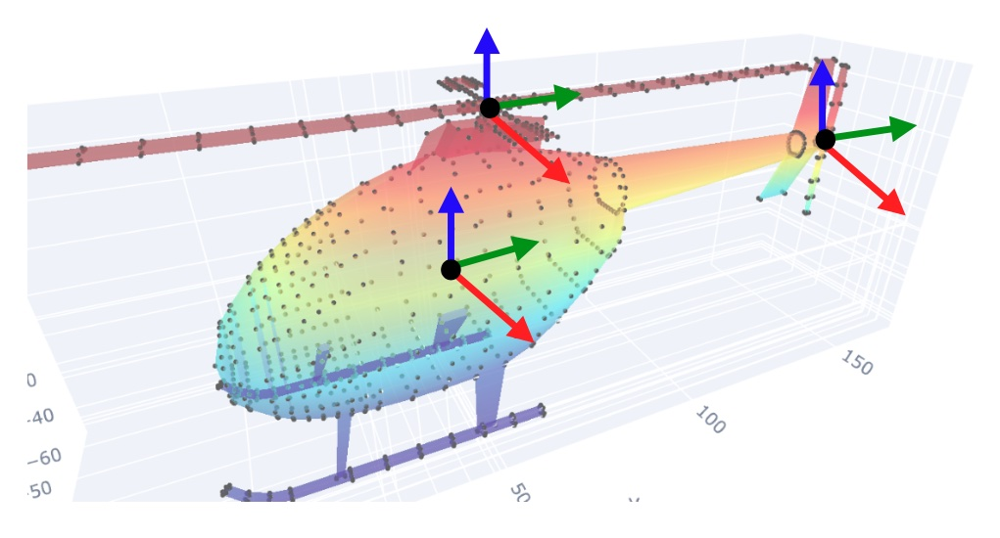

## The helicopter animation

#### Overview

In this assignment, you will create an animation of objects represented by point clouds. You will animate the helicopter from the `.ply` file `chopper.ply`. An image of the helicopter mesh is shown in Figure 1. This file and other mesh files are available from https://people.sc.fsu.edu/~jburkardt/data/ply/ply.html.

**Figure 1**: A mesh of a helicopter. 

You will animate the helicopter's two rotor blades (i.e., the top rotor and the tail rotor). Your animation will also show the chopper take off and land vertically.

Here, you will use your knowledge of *3-D transformations* and also the concept of *changing coordinate frames*. You will need to label the vertices that belong to each part to be animated so you can control the motion of those individual parts. The motion will be created by transforming (i.e., rotating and translating) the vertices (point cloud) of the parts. 

The actual segmentation procedure can be done automatically or manually using mesh-labeling or mesh-cutting tools. There are a number of ways that you can label the different parts of the point cloud. I suggest that you simply label them by their 3-D range (i.e., bounding box in 3-D space). 

Once the parts are labeled or selected, you will assign a local coordinate frame to each part and relate them by transformation matrices (i.e., you will create the transformation matrices). As an example of placement of local frames, Figure 2 shows three coordinate frames that you can use for this assignment, i.e., the main-body coordinate frame, the top-rotor coordinate frame, and the tail-rotor coordinate frame. The global coordinate frame is not shown in the Figure. You can use any other coordinate system arrangement that works for you. 

 

**Figure 2**: Local coordinate frames for different parts of the helicopter. The global coordinate frame is not shown. 

#### Submission instructions

#####What to submit: 

- **Submit a link to your animation** as a link to a cloud-based drive (e.g., Google Drive, or a link to a video service (e.g., Youtube). Please, do not submit the actual video file. 
- **Submit the code**. Submit the code that you wrote to create the animation (e.g., Python script, Jupyter notebook, Matlab script). Submit the entire code (except for external libraries).  <u>The submission is done via GitHub by pushing the relevant files to the assignment's GitHub repository</u>. 

#### Additional information

##### **On creating animated gif files** 

If you are creating an animated gif file to store the animation, you can do it automatically from your program using libraries functions or manually using Web-based services that create gif animations from a sequence of images (you will generate the images, of course). An example of such a service is: [http://gifmaker.me](http://gifmaker.me/) 

##### Studying the mathematical techniques

To complete the assignment, study the material in the module about transformations and change in coordinate frames. The materials consist of notes, book chapters, lecture slides, and some code examples. To obtain a good understanding of the problem and the underlying theory, you should try to study the whole set of materials.

##### Which library functions can you use? 

You can use any library function that do does perform the actual motion transformations or change-of-frame transformation matrices.  Because this assignment is about implementing geometric transformations using matrix multiplications, you are not allowed to use library functions that implement those transformations, e.g., rotate, scale, translate, rotation-about-an-axis, change of coordinate frames. Instead, you should write your own functions for those transformations. If you are in doubt about what functions to use then ask me. 

#####  Some sample (starter) code in Python

- [**Step-by-step approach with numerical example (simplified 2-D scenario)**.](https://htmlpreview.github.io/?https://github.com/eraldoribeiro/changeOfCoordinates/blob/main/Change_in_coordinate_frames_Example.html) This example assumes the vertices (in the point cloud) are already in local coordinates. When points are given in global coordinates, then their coordinates must be converted from to the local frame prior to applying the desired local transformation. 

- [**Demo code showing the rotation of a single 3-D point in front of the helicopter**. ](https://github.com/eraldoribeiro/changeOfCoordinates/blob/main/animation_CircleAndChopper.py)This demo shows all three parts of the helicopter already segmented and ready to be used to solve the assignment. The demo also shows how to apply the required transformations between frames, i.e., from global to local and then to global again prior to plotting the updated point. This [video](chopper.mp4) shows the program's execution. 

- **Sample code for animations in Vedo**. The Simulation's tab of the [Vedo documentation page ](https://vedo.embl.es/)has examples of animations using the timer and mouse interaction. It is fine to simply generate animations using a loop and key-press interaction. You can also save screenshots of the multiple iterations of your program as images and create a video from them.  

- [Notes on selecting parts of a mesh object using Vedo](https://htmlpreview.github.io/?https://github.com/eraldoribeiro/changeOfCoordinates/blob/main/selectingMeshParts.html). These are some suggestions on how to use Vedo's mesh-cutter tools to select the parts of a mesh. If you want to use pre-cut meshes of the helicopter parts, they are available from the following links:

  - https://github.com/eraldoribeiro/changeOfCoordinates/blob/main/main_body.vtk
  - https://github.com/eraldoribeiro/changeOfCoordinates/blob/main/top_rotor.vtk
  - https://github.com/eraldoribeiro/changeOfCoordinates/blob/main/tail_rotor.vtk

  which can be downloaded to your local directory using Vedo functions such as: 

  

- [Picking the 3-D location of the local frames (notebook)](https://nbviewer.org/github/eraldoribeiro/rendering3DinColab/blob/main/displayMeshInColabUsingOpen3DandPlotly.ipynb). This notebook uses `Plotly` to visualize the mesh. Plotly visualization displays the coordinates of the 3-D points when we click on the mouse pointer and move the pointer in space.  

 