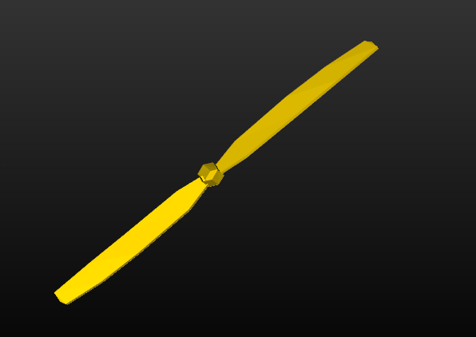
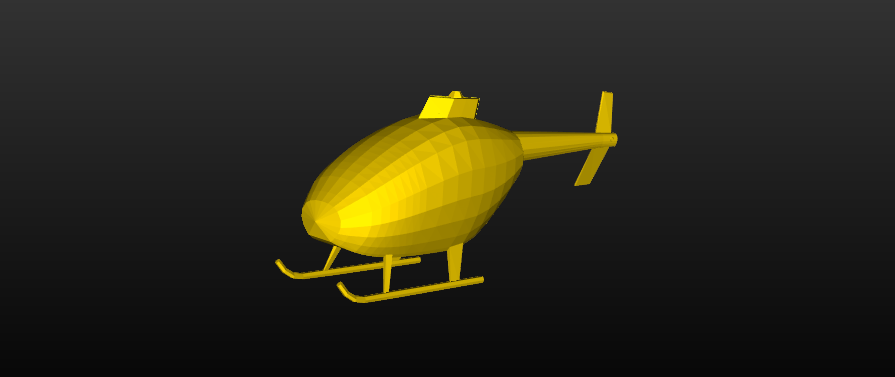
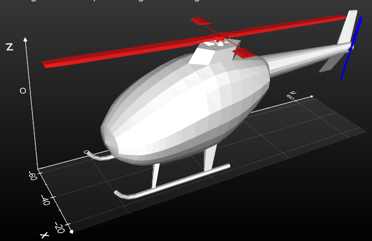

## Selecting mesh parts

Select the top and tail rotor. Also select the main body of the helicopter. To select and save the parts, we can use the following `Vedo` tools (demos): 

- `vedo/examples/basic/cutter.py`
- `vedo/examples/basic/cut_freehand.py`

If you just want to identify the cells that are between two planes, you can use: 

- `vedo/examples/basic/cellsWithinBounds.py`

Once selected the mesh parts can be saved (or converted) into their own .ply file (or any other useful mesh format). For example, `plt.add_cutter_tool()` saves the selected part to a `.vtk` file. 

Selecting the main body is a bit tricky. One way to do it is to perform multiple cuts and saves and also use the inverted option of the selection, i.e., inside-out selection. 

#### Top rotor 

Selected using `mesh_cutter.py`. This program saves a file named `clipped.vtk`. Once the mesh is correct, rename the vtk file to avoid getting it overwritten by another run of the program. Figure 1 shows the mesh of the top rotor. 

For smaller parts like the rotors, I used the `invert=False` option of `add_cutter_tool()` to allow for selecting from inside the bounding box, i.e,: 

```python
plt.add_cutter_tool(s, mode='box',invert=False) #modes= sphere, plane, box
```


**Figure 1**: Selected top rotor. 

#### Tail rotor 

The tail rotor can be selecting using the same settings that were used for the top rotor (Figure 2). 



**Figure 2**: Selected tail rotor. 

#### Main body

Select main body using `mesh_cutter.py` (Figure 3). I selected the main body by using the `invert=True` option of `add_cutter_tool()`, i.e,: 

```python
plt.add_cutter_tool(s, mode='box',invert=True) #modes= sphere, plane, box
```

Because the shape of the body is more complex and does not seem to fit in a single bounding box, we can repeat the clipping process multiple times until we have the correct mesh. Here, just call the program repeatedly and keep re-opening the file `clipped.vtk` until getting the right shape. Make sure to change the file name inside the program to `clipped.vtk`. 



**Figure 3**: Selected the main body. 

#### Displaying all parts (segmented)

Figure 3 shows all parts displayed together (color coded). 



**Figure 4**: All parts: body (white), top rotor (red), and tail rotor (blue). 

#### 

Sample code to show all parts ([Code](https://github.com/eraldoribeiro/changeOfCoordinates/blob/main/displayAllParts.py))

```python
"""Showing all mesh parts segmented by color"""
from vedo import *
import os  

# Read mesh file 
#fileName = 'https://people.sc.fsu.edu/~jburkardt/data/ply/chopper.ply'

# Read mesh files of each part, and color-label them
mainBodyMesh = Mesh("./main_body.vtk").c("white")
topRotorMesh = Mesh("./top_rotor.vtk").c("red")
tailRotorMesh = Mesh("./tail_rotor.vtk").c("blue")

# Show everything 
plt = show([mainBodyMesh, topRotorMesh, tailRotorMesh], __doc__, bg='black', bg2='bb', interactive=True, axes=1, viewup='z')

plt.close()
```

